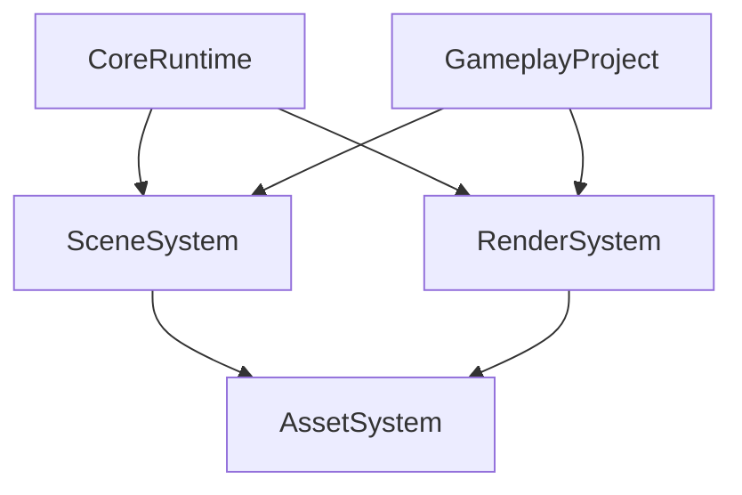

# ENGINE_PRELIMINARY_PLAN

## Goal

Build a stable `Engine-Project` architecture inside this repository that:
- covers current course tasks end-to-end;
- stays reusable for the next engine development course;
- avoids overengineering during the current semester.

## Scope For Engine v1

### In Scope
- Core runtime loop and subsystem orchestration.
- Scene with actors/components and parent-child hierarchy.
- Camera system: FPS camera, orbit camera, camera switching.
- Primitive mesh generation: box, sphere, plane.
- Basic asset pipeline: mesh/shader/texture descriptors and cache.
- Forward lighting baseline: Phong with directional light.
- Shadow system: Cascaded Shadow Maps with PCF.
- Deferred rendering path with GBuffer and directional/point/spot lights.
- Katamari-like gameplay systems on a plane.
- Particle system (CPU first).
- Gamma correction and postprocess chain.
- Parallax mapping and tessellation (advanced stage).

### Explicitly Out Of Scope For Current Semester
- Full visual editor with advanced gizmos and docking workflows.
- Full-blown ECS rewrite.
- Multi-platform rendering abstraction beyond Win32 + D3D11.
- Network multiplayer.
- Production-grade asset cooker and packaging pipeline.
- Full PBR material framework.

## Current Baseline

Existing foundations already present:
- Game loop and lifecycle in `Abstracts/Core/Game.*`.
- Actor/component model in `Abstracts/Core/Actor.*` and `Abstracts/Components/*`.
- Viewport subsystem and D3D11 init in `Abstracts/Subsystems/SceneViewportSubsystem.*`.
- Basic mesh rendering in `Abstracts/Components/MeshUniversalComponent.*`.
- Physics prototype in `Abstracts/Subsystems/PhysicsSubsystem.*`.
- Input prototype in `Abstracts/Subsystems/InputDevice.*`.

Main gaps to close:
- No dedicated scene hierarchy API.
- No camera/render context authority.
- No depth-stencil pipeline.
- No material/light framework for scalable passes.
- No import-based asset path for external models.
- No deferred/postprocess architecture.

## Target Architecture

## Workstreams

### 1) Foundation: Camera, Render Context, Depth
Objectives:
- Introduce camera authority for view/projection.
- Stop computing final camera matrices inside mesh components.
- Add depth-stencil resources to viewport frame setup.

Deliverables:
- `CameraComponent` and two controllers (`FpsCameraController`, `OrbitCameraController`).
- Render context object for per-frame camera/light/global data.
- Depth-stencil creation, bind, and clear in viewport subsystem.
- Projection mode switching support (multiple perspective presets).

Done Criteria:
- Scene renders correctly with depth testing enabled.
- Camera can switch between FPS and orbit at runtime.
- Mesh components consume render context instead of hardcoded identity view.

### 2) Geometry And Asset Track
Objectives:
- Provide reliable procedural primitives and external model loading.
- Remove hardcoded mesh data from gameplay classes when possible.

Deliverables:
- Primitive generation utilities (`GenerateBox`, `GenerateSphere`, `GeneratePlane`).
- Mesh data format with position/normal/uv/tangent support.
- Minimal `AssetManager` with cache by descriptor key.
- External model loading path (OBJ/Assimp-based starter).

Done Criteria:
- Spawn and render at least 10 boxes/spheres from generated data.
- Load at least several external models and place them randomly.
- Runtime cache avoids duplicate GPU buffer creation for identical assets.

### 3) Rendering Roadmap

#### 3.1 Phong Foundation
- Material and light constant buffers.
- Directional light first.
- Camera position in pixel shader.

#### 3.2 CSM And PCF
- Directional-light shadow pass with cascades.
- Stable split logic and cascade matrices.
- PCF filter path for shadow sampling.

#### 3.3 Deferred + GBuffer
- GBuffer targets (albedo, normal, material, depth).
- Geometry pass, lighting pass, final compose pass.
- Support directional, point, spot light in deferred.

#### 3.4 Post + Gamma
- Linear workflow and gamma-correct output.
- Tone mapping and first post stack.
- Extensible pass chain entry points.

Done Criteria:
- Forward path still valid for debugging.
- Deferred path produces matching gameplay visuals.
- Shadowing works in Katamari scene with acceptable stability.

### 4) Gameplay Track (Katamari-Like)
Objectives:
- Introduce gameplay architecture that uses engine systems, not one-off logic.

Deliverables:
- Parent-child transform hierarchy in scene.
- Plane-only gameplay world with random model placement.
- Bounding sphere pickup/growth system.
- Score/progression state tied to collected objects.

Done Criteria:
- Player sphere can collect objects based on size thresholds.
- Collected objects are attached and move with the player.
- Growth feedback affects gameplay in a deterministic way.

### 5) VFX And Advanced Surface
Objectives:
- Provide modern visual features required by assignments.

Deliverables:
- CPU particle emitter with billboard rendering.
- Parallax mapping support via height textures.
- Tessellation pipeline (HS/DS) for selected materials.

Done Criteria:
- Particle effects usable in at least one gameplay scenario.
- Parallax and tessellation toggleable for A/B validation.

## Milestones (12-Week Draft)

### Week 1
- Freeze Engine v1 scope and exclusions.
- Define folder/module boundaries for Engine vs Project code.

### Week 2
- Implement camera base and camera switching.
- Introduce render context data flow.

### Week 3
- Add depth-stencil resources and integration.
- Validate scene rendering with depth correctness.

### Week 4
- Add procedural box/sphere/plane generation.
- Render solar-system style setup (planets/moons + self-rotation).

### Week 5
- Introduce mesh/material descriptors and `AssetManager` cache.
- Integrate model import and random scene placement.

### Week 6
- Implement Phong pipeline with directional light.
- Validate material/light uniforms and camera-space data.

### Week 7
- Implement CSM split logic and shadow pass.
- Add PCF and shadow debug toggles.

### Week 8
- Implement GBuffer and geometry pass.
- Implement deferred lighting pass for directional light.

### Week 9
- Extend deferred lighting for point/spot lights.
- Stabilize performance and memory usage.

### Week 10
- Implement Katamari core loop: pickup, attach, growth.
- Tune collision sphere and spawn rules.

### Week 11
- Add postprocessing chain and gamma correction.
- Add CPU particles for gameplay feedback.

### Week 12
- Add parallax mapping and tessellation baseline.
- Reserve hardening/refactor buffer and release checklist.

## Risks And Mitigation

1. Shadow instability (shimmering, cascade artifacts)
- Mitigation: lock cascade math early, add debug visual overlays.

2. Deferred migration breaks forward assumptions
- Mitigation: keep forward fallback path and feature flags.

3. Asset import complexity grows unexpectedly
- Mitigation: start with minimal supported formats and strict validation.

4. Architecture drift due to rapid feature coding
- Mitigation: weekly decision log updates and API freeze windows.

5. Scope explosion
- Mitigation: maintain out-of-scope list and defer non-critical requests.

## Acceptance Gates

Gate A (Foundation Ready):
- Camera/depth/render-context complete and stable.

Gate B (Content Ready):
- Procedural primitives + imported models render reliably.

Gate C (Lighting Ready):
- Phong + CSM + PCF complete on target scene.

Gate D (Pipeline Ready):
- Deferred + post + gamma integrated and tested.

Gate E (Course Ready):
- Katamari gameplay + particles + advanced surface features operational.

## Decision Log

Use this section to capture architecture decisions during implementation.

### Decision Template
- Date:
- Decision:
- Alternatives considered:
- Why selected:
- Impact:

### Initial Decisions
- Date: 2026-03-05
- Decision: Build Engine v1 in current repository with strict scope and milestone gates.
- Alternatives considered: Full editor-first architecture; full ECS rewrite.
- Why selected: Best balance between course deadlines and long-term engine reuse.
- Impact: Faster progress now, controlled technical debt, easier migration next course.
